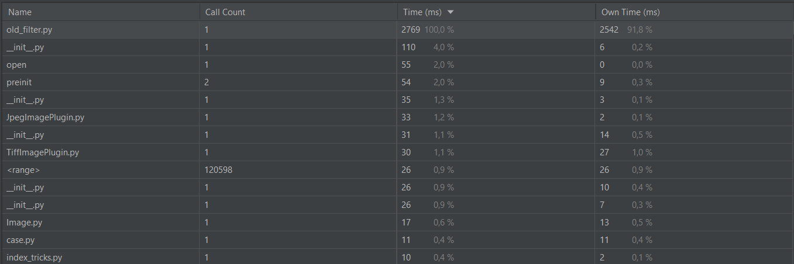
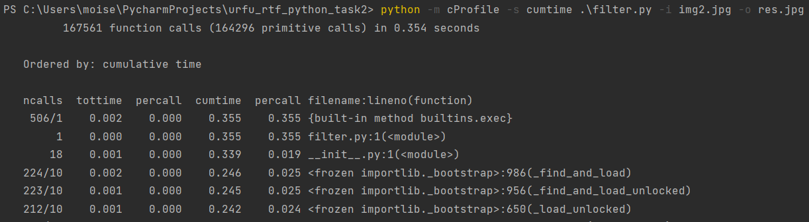
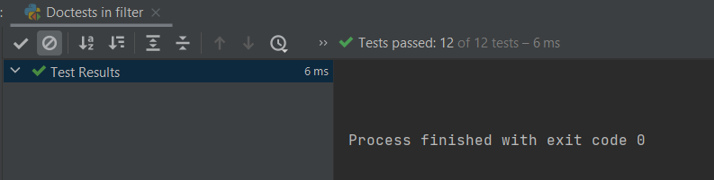
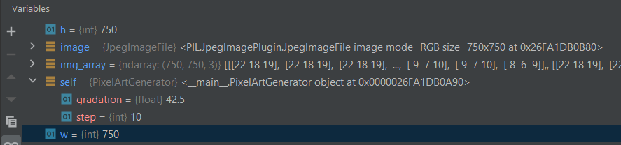

# Задание по теме №10 «PyCharm»
### № 5,6

Запуск old_filter.py c профилизатором.

Запуск filter.py c профилизатором.

Быстрее выполняется код после рефакторинга, т.к методы numpy в целом работают быстрее циклов.
### № 7,8
В моём случае - это не так. Я использую аргументы командной строки, поэтому я не трачу время на ввод данных с консоли. Поэтому данные профилизатора будут идентичный второму скриншоту (Запуск filter.py c профилизатором.)
### № 9,10,11 
Были написаны тесты и документация к основным методам класса PixelArtGenerator.

Результат запуска тестов.
### № 13,14
Результат работы отладчика:

